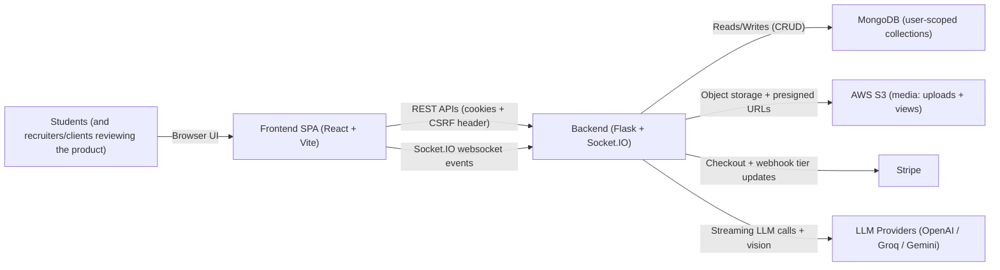
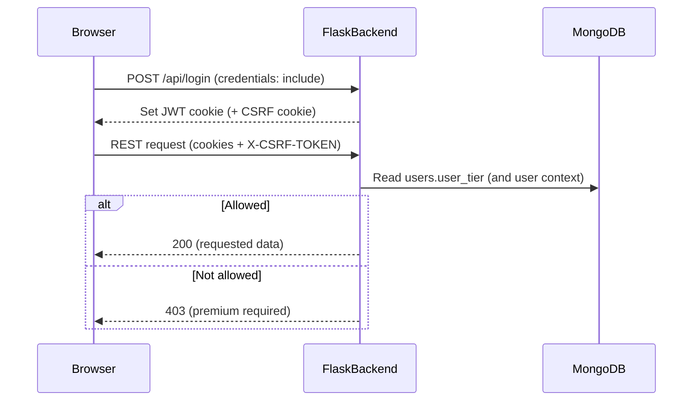
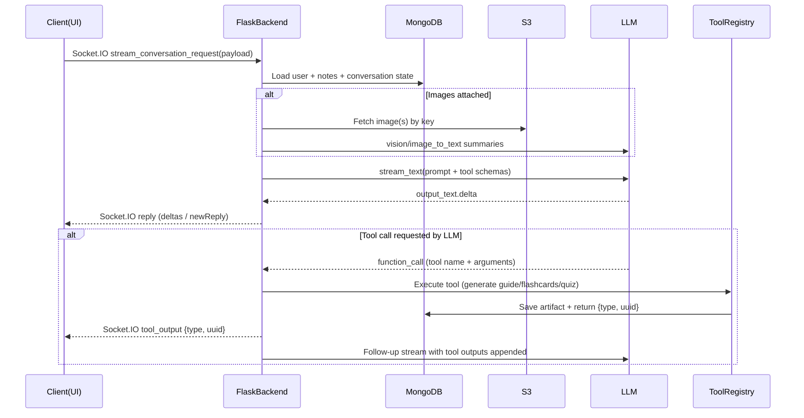
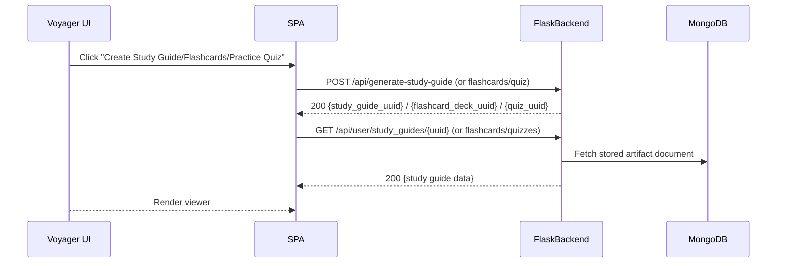

# eNotebook Product Architecture

eNotebook is a learning platform that combines (1) a real-time “AI tutor chat”, (2) structured note-taking, and (3) automated learning checkpoints like study guides, flashcards, and practice quizzes. The core engineering theme is simple: we turn raw learner intent (notes + conversation) into useful study artifacts using streaming AI generation, tool-driven workflows, and a secure, subscription-gated backend.

This document is written as a portfolio-style “product architecture” blog for recruiters and potential clients. It explains how the system is assembled end-to-end, mapping design decisions to what’s implemented in the project and the backend architecture that supports it.

## System Context

At runtime, learners interact through the SPA. The SPA talks to the backend through:
- REST endpoints for notes, onboarding, billing, and resource viewers
- Socket.IO events for tutor conversation streaming and tool outputs
- Media endpoints for image upload and retrieving view URLs from S3

The backend orchestrates MongoDB persistence, LLM streaming, and tool execution while enforcing feature gating based on subscription tier.

## Core Architecture Decisions (What Makes This Product “Real”)

### 1) Streaming tutor conversations with Socket.IO
The chat UX is designed to feel interactive: the client emits `stream_conversation_request`, and the backend streams incremental responses back over Socket.IO using a `reply` event.

On the chat client, the message pipeline is wired through Socket.IO and the backend stream handler:
- `socket.emit("stream_conversation_request", payload)`
- `socket.on("reply", handleReply)`
- tool artifacts surfaced via `socket.on("tool_output", ...)`

This approach matters because it supports:
- low-latency perceived responses (users don’t wait for full completion)
- structured tool outputs interleaved with conversational text

### 2) Schema-constrained generation + tool-driven learning artifacts
The backend describes an AI workflow where generation is paired with runtime tool execution:
- LLM streaming is driven by a prompt that includes tool schemas
- when the LLM requests a tool, the backend executes a matching function from a tool registry
- the resulting learning artifacts are persisted and then fed back into the conversation stream

Tool outputs are converted into viewer states in the chat experience, including:
- `study_guide_view`
- `flashcards_view`
- `quiz_view`

The product outcome is not just “chat”—it’s an ecosystem of study artifacts generated from the learner’s notes and conversation context.

### 3) Secure sessions + premium gating (JWT cookies + CSRF)
Authentication and feature access are designed to be production-friendly:
- login is performed via `/api/login` (cookies included)
- token validation uses `/api/validate-token`
- REST requests attach an `X-CSRF-TOKEN` header derived from a `csrf_access_token` cookie

The client extracts the CSRF token from cookies and uses it when calling APIs.

For feature gating, the client explicitly handles `403` responses by triggering an upgrade flow. This matches the backend’s tier decorator approach to protect premium actions.

### 4) Subscription lifecycle with Stripe webhooks
Billing correctness is handled through Stripe:
- `POST /api/stripe/create-checkout-session`
- `POST /api/stripe/create-portal-session`
- `POST /api/stripe/closed-beta-access`
- `GET /api/stripe/checkout-session/:sessionId`

The backend reference emphasizes the key mechanism: Stripe webhook events update the user’s `user_tier` in MongoDB. That makes the backend the source of truth for entitlement, rather than trusting client-side checks.

### 5) Media understanding via S3 uploads + view URLs
Learners can attach images to the tutor chat. The frontend uploads images using:
- `POST /api/uploads/image` (multipart upload)

For rendering images in chat history, the frontend retrieves view URLs:
- `GET /api/uploads/view-url?key=...`

This pipeline keeps the chat stream lightweight (metadata and references, not raw bytes) while storing long-lived media safely in object storage with controlled access.

## Data Model (MongoDB Collections)

The backend uses a user-scoped MongoDB model with main collections:
- `users`: identity, auth-related fields, billing identifiers, and feature gating fields
- `notes`: note “documents” keyed by note UUID, including header metadata and content payload
- `conversations`: conversation transcripts keyed by conversation UUID (messages, tutor metadata, bookmarks, timestamps)
- `user_quizzes`: generated quiz objects keyed by quiz UUID
- `user_study_guides`: generated study guide objects keyed by study guide UUID
- `user_flashcards`: generated flashcard decks keyed by flashcard deck UUID

This layout is optimized for:
- fast per-user CRUD operations (notes + conversations)
- natural retrieval of generated artifacts by UUID
- a conversation-first UX where study materials are always traceable to what the learner discussed

## End-to-End Flows (Portfolio-Grade “How It Works”)

### Flow A: Authentication + Tier Gating

The client uses `403` handling to initiate upgrade UX when premium resources are requested.

### Flow B: Tutor Streaming + Tool Orchestration

Tool outputs create viewer transitions in the chat experience (e.g., turning a tool result into a dedicated study artifact view).

### Flow C: Voyager Artifact Generation (REST -> UUID -> Viewer Fetch)

This UUID-based design reduces UI complexity by separating:
- generation request (async resource creation)
- viewer rendering (UUID-based retrieval)

## Security & Scalability Posture (Practical, Not Theoretical)

From the frontend implementation and the backend reference, key security/scalability decisions include:
- CSRF protection via `X-CSRF-TOKEN` header on REST calls (`csrf_access_token` cookie-derived)
- authenticated requests via cookies (`credentials: "include"` / `withCredentials: true`)
- presigned/controlled media access patterns (frontend fetches `view_url` from backend)
- server-side tier gating (premium actions return `403`; client shows upgrade UX)
- webhook-driven billing correctness (Stripe events update `user_tier` in MongoDB)

Operationally, the streaming strategy reduces “time-to-first-token” bottlenecks by prioritizing perceived responsiveness, and UUID-based retrieval keeps long-running generation results easy to cache and re-render.

## What This Architecture Enables

This architecture enables a product experience that feels cohesive:
- a tutor chat that streams in real time
- structured study artifacts that appear as first-class experiences (not only text)
- secure, subscription-gated access to premium study generation
- media-enhanced tutoring by attaching images and rendering them through S3-backed view URLs

For recruiters, the standout engineering maturity signals are:
- realtime streaming UX using Socket.IO events
- tool-based LLM orchestration with persisted artifacts
- production-oriented session handling patterns (cookies + CSRF + gating)
- billing lifecycle integration with Stripe webhooks for server-truth access control

