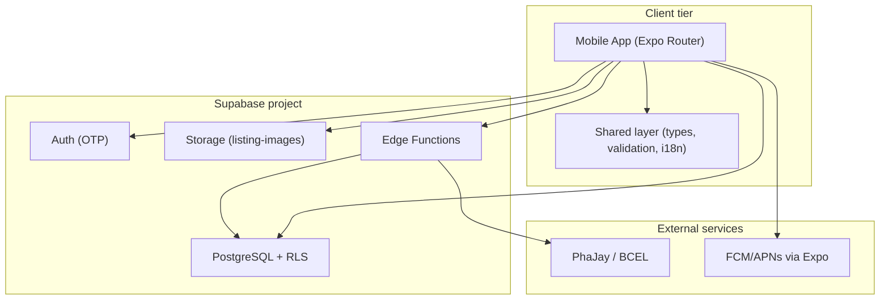

# ReLoop — Case Study

## Overview

ReLoop is a mobile-first marketplace that connects Vientiane food vendors with customers who want to buy end-of-day surplus at a discount — reducing waste while giving both sides a better deal.

---

## The Problem

Vientiane's food-service sector throws away an estimated **29,000–31,000 tonnes of food per year**. Bakeries, cafés, and hotel buffets often have predictable surplus at closing time, but there is no simple way to sell it before it is discarded.

Customers want discounted food. Vendors want to recover some revenue instead of paying disposal costs. Neither side has a trusted, low-friction channel to meet.

The business case is clear: OpenStreetMap data shows **817 restaurants and 313 cafés** in Vientiane — a planning universe of **1,100–1,500+ merchants**. At even conservative waste levels (2–4 kg per outlet per day), the city could support **4,500–9,000 rescue bags daily**. Laos also has **4.97 million internet users**, so a mobile-first product can reach buyers where they already are.

The product challenge is different. Our team could not afford a fragile stack, a separate vendor app, or payment logic that breaks under real money. The system must be secure, cheap to run, and fast to iterate — starting with a **pickup-first** model that keeps logistics simple until marketplace density grows.

---

## Our Role

Our ReLoop team designed and built the full v1 product architecture end to end:

- **Mobile app** — one Expo binary with separate customer and vendor experiences (`apps/mobile`)
- **Backend** — Supabase Postgres with Row Level Security, Auth, Storage, and Edge Functions
- **Shared domain layer** — types, validation rules, and i18n in `packages/shared`
- **Database schema** — SQL migrations, RLS policies, and safe evolution workflows in `supabase/migrations`
- **Documentation** — schema reference, architecture rules, and data-flow docs that keep future changes safe

We did not just sketch diagrams. We shipped working flows: vendor listing create/edit, photo upload, validation, dashboard aggregation, and the data model that supports orders and payments.

---

## The Solution

### Start small, prove density in one city

We scoped the launch around predictable surplus — bakeries, cafés, and buffets — not every restaurant type at once. Pickup-first keeps costs down until the marketplace has enough merchants and buyers in the same area.

The 90-day target is **100 active merchants**. Success will be measured by bags per merchant per day, sell-through rate, repeat purchases, and refund rate — not vanity downloads.

### One app, two experiences

We built a single Expo app with route groups for auth, customers, and vendors. Vendors get listing management and a dashboard. Customers get browse and reserve flows. One codebase, one deploy, half the maintenance of two apps.

**Stack:** Expo Router, React Query, TypeScript, Supabase (Postgres + RLS + Auth + Storage + Edge Functions), PhaJay for LAK payments.

### Make listing creation reliable

Vendors need to publish a surplus bag in minutes. We split the work cleanly:

- **Screens orchestrate** — `create-listing.tsx` and `edit-listing/[id].tsx` handle UI state and navigation
- **Domain logic lives in one place** — `listing-field-validation.ts` owns all field rules
- **Persistence handles failure** — `listing.ts` inserts the listing, uploads the cover photo, links it in `listing_images`, and rolls back if upload fails

This prevents orphaned listings when a photo upload breaks mid-flow.

Validation catches real business mistakes before they hit the database:

- Pickup window must end after it starts, and cannot already be in the past for same-day listings
- Discount price must stay below the original price
- Category must match the allowed set (`food`, `bakery`, `furniture`)
- Create requires a photo; edit allows keeping the existing cover

When a listing has open orders, commercial fields lock so vendors cannot change price or quantity mid-fulfillment.

### Align the database with the app

We kept categories simple for v1: a constrained string column on `listings`, not a separate table. The same values live in shared TypeScript types and a Postgres CHECK constraint, so the app and database never disagree.

When we added the category column to existing data, we used a safe migration pattern: backfill nulls, set a default, enforce NOT NULL, then add the constraint. No broken rows, no manual dashboard edits.

Photos follow the same discipline. Files go to Supabase Storage (`listing-images` bucket). Metadata lives in `listing_images` with a deterministic path: `{partner_id}/{listing_id}/cover.jpg`. The vendor is reached through `listings.partner_id`, not by storing images on the partner row.

### Secure by default

Every table uses Row Level Security. Customers see only active listings from approved partners. Vendors access only their own store's data through `partner_members`. Payment confirmation runs through Edge Functions and webhooks — the mobile app never marks an order as paid on its own.

This matters when real money moves through PhaJay. Trust the webhook, not the redirect URL.

### Document as we build

We wrote schema docs, architecture rules, and migration checklists alongside the code. When we change the database, we update the migration file, the shared types, and the docs in the same pass. That keeps the project maintainable six months later.

---

## System at a Glance

Figure: How the mobile app connects to Supabase and external services.

---

## The Impact

### Market opportunity (validated, not yet live)

| Metric | Value |
| --- | --- |
| Mapped restaurants (Vientiane) | 817 |
| Mapped cafés (Vientiane) | 313 |
| Planning merchant universe | 1,100–1,500+ |
| Annual food-service waste (proxy) | 29,000–31,000 tonnes |
| Internet users (Laos) | 4.97 million |
| 90-day merchant target | 100 active merchants |

### Rescueable inventory potential (city-wide, daily)

| Scenario | Per outlet | City total |
| --- | --- | --- |
| Conservative | 4–8 bags | 4,500–9,000 bags |
| Base case | 10–16 bags | 11,000–18,000 bags |
| Aggressive | 20–30 bags | 22,000–34,000 bags |

These numbers come from market analysis, not live product metrics. They define what success looks like once the marketplace reaches density.

### What the build delivers today

- **End-to-end vendor listing flow** — create, edit, photo upload, validation, and dashboard rendering
- **Schema ready for orders and payments** — listings, orders, payment events, and RLS policies documented and migrated
- **Safe change process** — migrations with backfill, shared type sync, and written standards for future schema work
- **Pickup-first architecture** — no delivery complexity baked in; can add it after density proves out

### What we are tracking next

Once merchants go live, we will measure the metrics that matter for investor and product proof:

- Active merchants and bags listed per merchant per day
- Sell-through rate (listed vs. sold)
- Repeat purchase rate
- Refund and cancellation rate

The technical foundation is built to support those numbers. The next phase is density — getting the first 100 merchants listing daily surplus and proving the base-case rescue volume is reachable.

---

## Key Technical Decisions

| Decision | Why |
| --- | --- |
| Supabase over self-hosted backend | Faster to ship, RLS built in, no server ops for a lean team |
| One mobile app, two portals | Half the deploy cost; shared auth and shared types |
| Centralized validation module | One source of truth for create/edit rules; UI stays thin |
| Category as constrained string | Simple for v1; avoids extra joins until categories need metadata |
| Pickup-first, no delivery v1 | Controls cost until marketplace density justifies logistics |
| Webhook-only payment confirmation | Prevents fake "paid" states from client-side redirects |

---

## What's Next

- Onboard first merchant cohort and measure sell-through against the base-case projections
- Add inventory reservation via a Postgres RPC to prevent overselling the last bag
- Expand from cover photo to multi-photo listings using the existing `listing_images` schema
- Harden observability with structured error codes and production logging

---

_ReLoop — Save More. Waste Less._
