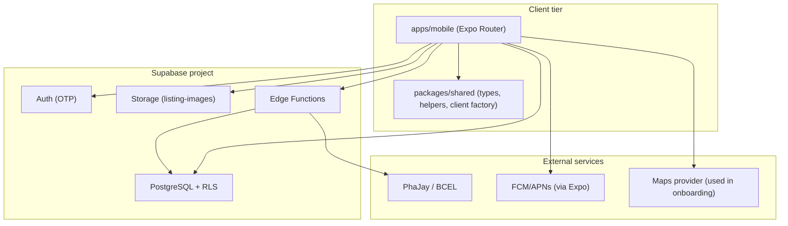

# ReLoop — Product Architecture (Portfolio)

This page explains how ReLoop’s mobile-first marketplace architecture was designed and implemented end-to-end: UI flows, validation, data modeling in Supabase, and the safeguards used to ship safely.

Repository artifacts referenced throughout:

- Mobile UI & orchestration: `apps/mobile/src/app/(vendor)/create-listing.tsx`, `apps/mobile/src/app/(vendor)/edit-listing/[id].tsx`
- Shared validation & domain mapping: `apps/mobile/src/lib/listing-field-validation.ts`
- Supabase write logic & photo attachment: `apps/mobile/src/lib/listing.ts`
- Vendor dashboard aggregation: `apps/mobile/src/lib/vendor-dashboard.ts`
- Schema + RLS + migration strategy: `docs/DB/SCHEMA.md`, `docs/DB/LISTING_PHOTOS.md`
- Category constraint migration: `supabase/migrations/20260717100000_listings_category.sql`
- Shared types (source of truth for category): `packages/shared/src/types/index.ts`

---

## 1) Product hook (what this architecture enables)

ReLoop helps vendors publish items (called _listings_) and lets customers browse and reserve those listings using a secure, RLS-protected Supabase backend.

The architecture is optimized for a solo-team v1 rollout by keeping logic centralized and boring:

- One Expo mobile app with distinct customer/vendor route groups.
- Supabase as the product backend: Postgres (+ RLS), Auth, Storage, and Edge Functions.
- Consistent domain rules (validation + category constraints) so UI behavior matches DB invariants.

Key architectural focus: **a constrained listing category model**, **robust client-side validation**, and **safe schema evolution via migrations**.

---

## 2) 1-minute system overview (big picture)

At a high level, the mobile app:

1. Collects vendor input in listing create/edit screens.
2. Validates domain rules in a dedicated module.
3. Persists listing records in Postgres.
4. Uploads cover images to Supabase Storage and links them through `listing_images`.
5. Refreshes UI via cached queries and server-backed reads.

Supabase enforces authorization with RLS, and payment completion is handled via Edge Functions/webhooks (never trusted from the client).

---

## 3) Big picture diagram (containers + data flow)

Figure: ReLoop system context (mobile → Supabase → Storage/Edge).



---

## 4) Client-side architecture (how the UI becomes reliable business behavior)

The most important design choice in the client is that **screens orchestrate**, while **domain logic lives in a library**.

### 4.1 Create Listing flow (UI → validation → DB insert → image upload → link)

Start point: `apps/mobile/src/app/(vendor)/create-listing.tsx`  
Composition:

- Form UI fields are rendered by `apps/mobile/src/components/vendor/ListingInfoFields.tsx`.
- Cover image selection/preview is handled by `apps/mobile/src/components/vendor/ListingPhotoField.tsx`.
- Business validation and domain mapping live in `apps/mobile/src/lib/listing-field-validation.ts`.
- Persistence + rollback logic live in `apps/mobile/src/lib/listing.ts`.

In `apps/mobile/src/lib/listing.ts`, `createListingFromForm()` performs:

1. Insert into `listings` (DB row must exist first).
2. Upload cover image to Storage using a deterministic storage path.
3. Insert into `listing_images` with `sort_order = 0` (cover).
4. If upload/linking fails after the listing insert, it **deletes the listing** as cleanup to prevent orphaned data.

### 4.2 Edit Listing flow (seeding + read-only locking + optional photo replacement)

Start point: `apps/mobile/src/app/(vendor)/edit-listing/[id].tsx`

The edit screen is initialized by converting the fetched listing entity into form values via `listingToFormValues(...)`.

Two key “smartness” features:

- **Read-only locking** of commercial fields when the listing has open orders (prevents inconsistent business changes mid-fulfillment).
- **Photo edit rules**: keeping the existing cover is valid; picking a new photo replaces the cover.

This is enforced by `validateListingPhotoForEdit(...)`:

- If `photo.localUri` exists, validation passes.
- Otherwise, validation passes only if `existingCoverUrl` is already present.

### 4.3 Vendor dashboard (aggregation + UI rendering)

The vendor dashboard aggregates order status and listing availability using `apps/mobile/src/lib/vendor-dashboard.ts`:

- Recent orders are grouped by `checkout_id`.
- Active listings count is computed server-side filtered by `active` and `quantity_available` semantics from `listings`.

This keeps the vendor UI responsive and consistent without duplicating business logic across components.

---

## 5) Validation & domain rules (portfolio differentiator)

All listing-field business rules are centralized in `apps/mobile/src/lib/listing-field-validation.ts`.

Examples of domain validation implemented:

- **Category validity** is checked against `LISTING_CATEGORIES` and shared types (`packages/shared/src/types/index.ts`).
- **Price validation** enforces positive values and correct relationships:
  - `originalPriceLak` must be >= `priceLak` (when both are provided).
- **Quantity validation** requires `quantity >= 1`.
- **Pickup window validation**:
  - Time format uses `TIME_REGEX = /^([0-1]?\d|2[0-3]):[0-5]\d$/`
  - Enforces `pickup_end > pickup_start` (on same pickup date).
  - For `today` pickup, rejects windows whose end has already passed.
- **Photo validation**:
  - Create: cover photo is required (`photo.localUri` must exist).
  - Edit: cover is required only if neither a new photo is picked nor an existing cover URL is present.

Why this matters for architecture: the UI can be aggressive (instant feedback) without drifting from the DB’s invariants.

---

## 6) Data architecture (DB + categories + photos)

ReLoop uses a relational model where:

- `listings` is the sellable offer.
- `listing_images` stores photo metadata and points to Storage paths.
- Category is modeled as a constrained string column on `public.listings`.

Figure: Workflow-to-tables mapping for listing publishing.

```mermaid
flowchart LR
  A[Vendor fills listing form] --> B[Validate fields + validate photo]
  B --> C[Insert into public.listings]
  C --> D[Upload cover to Storage listing-images]
  D --> E[Insert into public.listing_images (sort_order=0)]
  E --> F[UI refresh via cached queries + server-backed reads]
```

### Categories (no separate table)

Category is **not** modeled as a `categories` table. Instead:

- `public.listings.category` is a text constrained by a CHECK constraint.
- Shared source of truth: `packages/shared/src/types/index.ts`:
  - `ListingCategory = 'furniture' | 'bakery' | 'food'`

The migration enforcing this safely is `supabase/migrations/20260717100000_listings_category.sql`:

- Adds `category` if missing
- Backfills nulls with default `'food'`
- Sets default and NOT NULL
- Adds CHECK constraint `category in ('furniture', 'bakery', 'food')`

### Listing photos (Storage + `listing_images`)

Photos are intentionally not stored on the `partners` row directly.
Per `docs/DB/LISTING_PHOTOS.md`, the chain is:
`listing_images.listing_id -> listings.id -> listings.partner_id -> partners.id`.

Figure: Editing vs create behavior (validation + photo replacement rules).

```mermaid
flowchart TB
  subgraph CreateMode[Create Listing]
    C1[Picked photo?] -->|No| C2[validateListingPhoto fails]
    C1 -->|Yes| C3[validateListingFields + photo ok]
    C3 --> C4[createListingFromForm]
  end

  subgraph EditMode[Edit Listing]
    E1[Picked new photo?] -->|Yes| E2[validateListingPhotoForEdit ok]
    E1 -->|No| E3[existingCoverUrl exists?]
    E3 -->|No| E4[validateListingPhotoForEdit fails]
    E3 -->|Yes| E5[allow keeping current cover]
    E2 --> E6[updateListingFromForm (replace cover)]
    E5 --> E7[updateListingFromForm (keep cover)]
  end
```

---

## 7) Schema evolution & safety (migration story)

Reloop treats the database schema as the system of record and evolves it through timestamped SQL migrations under `supabase/migrations/`.

The `docs/standards/DATABASE_EXPECTATIONS.md` approach (and how this impacts the portfolio) is:

- Never edit production tables directly without a migration file.
- Include RLS policy changes in the same migration.
- Update shared TypeScript types after schema changes.

The category migration is a good example of “safe change” under real data:

- It backfills existing rows before enforcing `NOT NULL`.
- It drops/re-adds the CHECK constraint to match the intended enum values.

---

## 8) AuthZ / RLS & security (only what matters)

Per `docs/DB/SCHEMA.md`:

- RLS is enabled on all `public.*` tables.
- No policy means no access (principle of least privilege).
- `payment_events` has **no client access**; only Edge Functions use `service_role` to insert and update payment state safely.

The architecture rules documented in `docs/standards/ARCHITECTURE_RULES.md` align with this:

- Screens and hooks use publishable/anon keys and user JWT only.
- Edge Functions are the only place using service role for privileged writes/webhooks.

Portfolio takeaway: the UI never “trusts” payment success; payment confirmation is driven by webhooks and stored in the DB.

---

## 9) Development process (stages)

Figure: Development stages linked to concrete artifacts.


How this was applied in practice:

- Discovery: define domain invariants for listing/category/time/photo (implemented in `listing-field-validation.ts`).
- Design: choose a constrained category string (instead of a separate categories table) to keep the v1 data model small and consistent with shared types.
- Implementation:
  - centralized validation
  - orchestration in create/edit screens
  - transactional thinking (rollback cleanup when photo attachment fails after listing insert)
- Validation & correctness:
  - create vs edit photo rules
  - pickup window correctness (including “already passed” rejection for today)
- Release/migration:
  - category migration includes backfill + constraint enforcement
  - shared types are updated in tandem (`packages/shared/src/types/index.ts`)

---

## 10) Key tradeoffs & decisions (3–5)

### Decision 1: Category as constrained string (no categories table)

- Why: fewer moving parts for v1; category values are stable and small, and it avoids extra joins for browse/create flows.
- Evidence:
  - DB: `public.listings.category` constrained by CHECK in `supabase/migrations/20260717100000_listings_category.sql`
  - TS: `ListingCategory` + `LISTING_CATEGORIES` in `packages/shared/src/types/index.ts`
- What I’d improve later: introduce a `categories` table only if categories become user-editable or require localized metadata.

### Decision 2: Photos via `listing_images` metadata + Storage paths

- Why: allows many photos per listing (future-proof), keeps DB small, and supports cover ordering via `sort_order`.
- Evidence:
  - Schema docs: `docs/DB/LISTING_PHOTOS.md`
  - DB tables: `public.listing_images` references `public.listings`
  - Client: cover derived from lowest `sort_order` and mapped to `cover_image_url`
- What I’d improve later: add automatic cleanup of orphaned Storage objects when DB rows are deleted.

### Decision 3: Validation centralization in `listing-field-validation.ts`

- Why: prevents drift between UI behavior and domain rules; makes edit/create differences explicit.
- Evidence:
  - `validateListingFields`
  - `validateListingPhoto` and `validateListingPhotoForEdit`
  - category validation uses shared `LISTING_CATEGORIES`
- What I’d improve later: add targeted unit tests for validation edge cases (time boundaries).

### Decision 4: Supabase-driven security (RLS + Edge Functions)

- Why: least privilege and safe payment handling.
- Evidence:
  - `docs/DB/SCHEMA.md` RLS policy summary and “no client access” for `payment_events`.
  - `docs/standards/ARCHITECTURE_RULES.md` prohibits service role from clients.
- What I’d improve later: ensure storage policies cover all required operations (docs mention follow-up policies depending on migration stage).

---

## 11) Future roadmap (what’s next)

Near-term improvements (practical hardening):

- Add unit tests around listing validation rules (time window formatting, already-passed rejection, category constraints).
- Tighten storage/RLS policies specifically for `listing_images` read/write workflows (closing any v1 gaps).
- Improve resilience for inventory/quantity reservation with a DB transaction/RPC (reduce oversell risk).

Longer-term improvements:

- Introduce multi-photo UX (beyond cover) using existing `listing_images` ordering.
- Expand category model only if categories need metadata/localization beyond the fixed enum.
- Add richer observability: structured error codes from `lib/listing.ts` and tracing from client to edge function.
